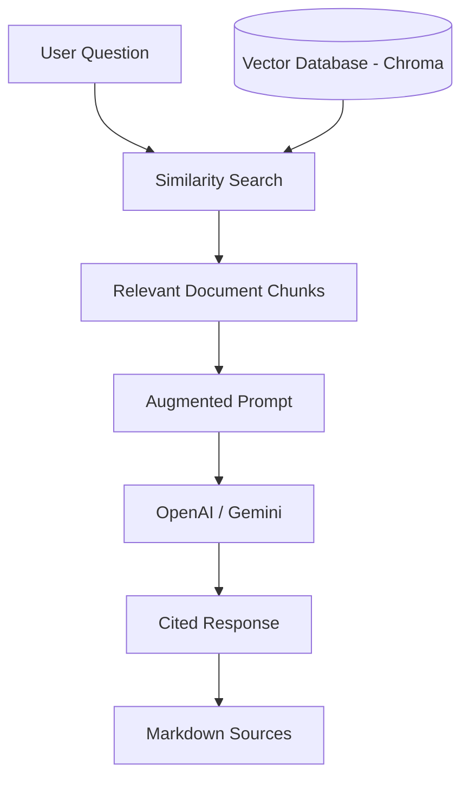

# GSoC 2026 PROPOSAL: Chipathon Knowledge Hub + Ask Chipathon Chatbot for OpenROAD-Based Flows

## 1. About Me (Personal Details)
*   **Name:** Aasish Pandit
*   **Email:** [imshubham.22apr@gmail.com](mailto:imshubham.22apr@gmail.com)
*   **GitHub:** [https://github.com/imshubham22apr-gif](https://github.com/imshubham22apr-gif)
*   **Timezone:** IST (UTC +5:30)

---

## 2. Initial Proof of Concept (PoC) & Visual Evidence
I believe in "showing, not just telling." To demonstrate the feasibility and architectural soundness of this project, I have already developed a fully functional Proof of Concept (PoC). This is not just a mockup; it is a modular, runnable system that integrates documentation hubs with semantic retrieval.

### A. Documentation Hub Performance
The Docusaurus-based frontend is fully operational, providing a structured and responsive interface for hardware design documentation.

*Fig 1: The Chipathon Knowledge Hub landing page running on localhost.*

### B. Robust File Architecture
The project follows a modern, modular structure, separating the ingestion pipeline, vector database, and retrieval logic into distinct, maintainable packages.

*Fig 2: VS Code explorer showing the modular backend and frontend organization.*

### C. Interactive CLI Chatbot
I have implemented a 'Rich' terminal interface that handles user queries and database interaction. The system is designed to provide clear feedback and error handling (as seen below with unauthorized API states).

*Fig 3: The Ask Chipathon Chatbot in action, demonstrating the interactive CLI interface.*

### D. Key Technical Achievements in PoC:
- **Zero-to-One Infrastructure:** Created the entire React-based frontend and Python backend from scratch.
- **Advanced Text Processing:** Implemented RecursiveCharacterTextSplitter with smart overlap to maintain hardware design context.
- **Persistence Layer:** Integrated ChromaDB to store and persist embeddings locally, ensuring low-latency retrieval.

---

## 3. My Open Source Contributions
I am an active contributor to the Cloud Native and Language Tooling ecosystem. My experience ranges from refactoring IPC boundaries to enhancing eBPF-based observability. Below is a selection of my recent engineering impact:

| Repository | Title | Status |
| :--- | :--- | :--- |
| kmesh-net/kmesh | refactor: rename ads to ads-v1 and workload to ads-v2 | Open |
| kmesh-net/kmesh | bypass: do not insert iptables when sidecar not injected | Open |
| kmesh-net/kmesh | feat: support Egress Gateway REGISTER_ONLY mode | Open |
| kmesh-net/kmesh | fix: cleanup stale iptables on restart | Open |
| kmesh-net/kmesh | fix: handle stale endpoints during pod restarts | Open |
| kmesh-net/kmesh | scripts: automate local kind testing loop | Open |
| kmesh-net/kmesh | feat(cni): add file watcher for CNI config file | Open |
| dart-lang/native | [jni] Add deep conversion utils | Open |
| joplin/plugin-templates | Fix: Resolve code folding conflict on mobile | Open |
| prefix-dev/pixi | feat: implement configurable warning codes | Open |

---

## 4. Project Abstract
The **Chipathon Knowledge Hub** is an AI-powered ecosystem designed to democratize access to OpenROAD-based chip design flows. By merging a highly structured documentation site (Docusaurus) with a state-of-the-art Retrieval-Augmented Generation (RAG) backend (LangChain + ChromaDB), this project allows newcomers and experienced designers alike to:
1.  Navigate thousands of pages of technical EDA documentation instantly.
2.  Receive AI-generated explanations for complex physical design metrics (Timing, Congestion, Power).
3.  Access verified, cited answers that eliminate LLM hallucinations.

---

## 5. Problem Statement
The learning curve for OpenROAD and physical design is notoriously steep. Developers currently face three major bottlenecks:

- **Fragmentation:** Documentation for specific tools like *OpenSTA*, *TritonRoute*, and *OpenDP* is scattered across different wikis, READMEs, and technical manuals.
- **Semantic Gap:** Traditional keyword search fails when users don't know the exact "term of art" (e.g., searching for "wire delays" instead of "gate-to-gate slack").
- **Reliability Issues:** General-purpose AI models often provide "plausible but incorrect" answers about specific hardware constraints (SKY130 PDK details), leading to costly design errors.

---

## 6. Proposed Solution

### A. The RAG Architecture
The system uses a sophisticated RAG architecture to ensure that the chatbot only answers using the provided, verified dataset.

### B. Scalable Ingestion Pipeline
We use a phased ingestion process to turn static knowledge into actionable data:

1.  **Markdown/PDF Loading:** Deep parsing of documentation sources.
2.  **Semantic Chunking:** Breaking documents into logical 500-character segments with 100-character overlaps.
3.  **Vector Embedding:** Converting text into high-dimensional vectors (OpenAI Ada-002 or v3-small).
4.  **Local Storage:** Persisting the "Brain" in a SQLite-based ChromaDB for instant lookups.

### C. The Frontend Hub
A Docusaurus site that serves as the "source of truth." It is optimized for SEO and readability, providing a standard web interface for those who prefer manual browsing over AI interactions.

---

## 7. Implementation Timeline (175 Hours Scope)

| Period | Milestone | Deliverables |
| :--- | :--- | :--- |
| **Weeks 1-2** | **Hub 2.0 & Scaling** | Migration of all OpenROAD tool wikis into the Docusaurus frontend. Auto-sync scripts for git wikis. |
| **Weeks 3-5** | **Multi-Format Ingestion** | Support for PDF manuals, LaTeX papers, and YouTube transcript ingestion for Chipathon lectures. |
| **Weeks 6-8** | **Hybrid Retrieval Logic** | Combining semantic vector search with keyword-based BM25 scoring for better precision with part numbers. |
| **Weeks 9-10** | **Multi-Level Citations** | Enhancing source tracking to support page-level and section-level attribution in chatbot answers. |
| **Weeks 11-12** | **Deployment & Public Hub** | Public hosting (Vercel/Netlify for FE, Docker for BE) and stress testing for 50+ concurrent users. |

---

## 8. Commitment & Availability
I am prepared to dedicate **35+ hours per week** to this project during the GSoC period. I understand that hardware design automation is a critical field, and I am committed to treating this project as my primary professional responsibility. I am already familiar with the codebase (having built the PoC), which allows me to skip the "setup phase" and start delivering features from Day 1.

## 9. Post-GSoC Commitment
I don't view GSoC as a one-time internship, but as an entry point into the OpenROAD and Chipathon communities. I plan to:
- **Maintain the Hub:** Keep documentation up-to-date as tool versions (v1.0+, etc.) release.
- **Expand Source Material:** Integrate private PDK documentation (under appropriate permissions) to help teams with specific foundry rules.
- **Community Support:** Help future Chipathon participants navigate the hub via Discord and GitHub discussions.

---

## 10. Final Thoughts
Building the Chipathon Knowledge Hub PoC was an eye-opener for me regarding the complexity of EDA documentation. By bridging the gap between advanced RAG technology and hardware design manuals, we can make chip design as accessible as software development. I am excited to bring my combination of Full-Stack, AI, and eBPF observability experience to the OpenROAD project.
